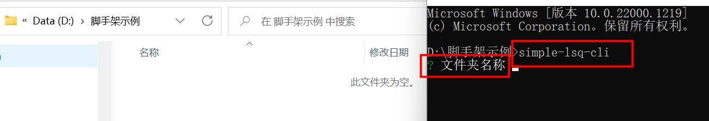
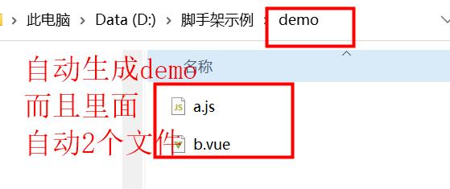

## simple-lsq-cli

这是一个简易的自定义脚手架，我个人很草率的认为，脚手架核心就是复制模板文件，然后在执行命令行的对应目录下生成文件，当然还有其他的。所以这个示例，是一个示例，自定义文件夹名称后，会在目录下生成这个文件夹，然后里面的文件是复制了我脚手架里的模板。

---

## npm insall

安装项目所需依赖。

---

## 本地调试

这个简易脚手架写好以后，可以先在本地测试一下。

1. 修改 `package.json` ，将其改为私有， `"private": true`
2. 在项目的目录下执行 `npm link`，则将该插件安装到自己本地了
3. 在任意地方执行 `npx simple-lsq-cli`，会让你输入文件夹名称，然后自动生成该文件夹，并里面有 2 个模板文件
   以上本地测试成功了，那说明这个简易脚手架成功，然后就可以发布它。

---

## publish 发布

发布只需要修改一下 `package.json`，去掉 `"private": true`，并配置

```js
"publishConfig": {
    "registry": " https://registry.npmjs.org/"
  },
```

## 然后 `npm publish` 就发布啦，再 `npm install simple-lsq-cli`安装依赖，然后 执行 `simple-lsq-cli` 就会让你输入文件名称，然后自动生成文件夹。

---

## 使用示例



